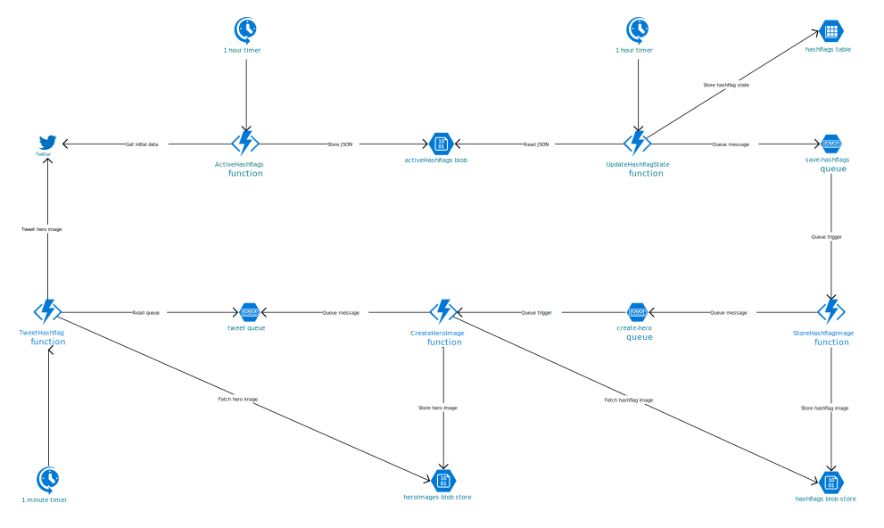

# Twitter Hashflags Azure Functions

This git reposistory contains a collection of Azure functions related to Twitter [hashflags](http://hashfla.gs/). Currently there are 5 functions:

1. `ActiveHashflags` fetches the active  from Twitter, and stores them in a JSON object in an Azure Storage Blob. You can find the list of current hashflags [here](https://hashflags.blob.core.windows.net/json/activeHashflags).
1. `UpdateHashflagState` reads the JSON, and updates the hashflag table with the current state of each hashflag.
1. `StoreHashflagImage` downloads the hashflag image, and stores it in a blob store.
1. `CreateHeroImage` creates a hero image of the hashtag and hashflag.
1. `TweetHashflag` tweets the hashtag and hero image.

## What is a Hashflag?

A hashflag, sometimes called Twitter emoji, is a small image that appears after a *#hashtag* for special events. They are not regular emoji, and you can only use them on the Twitter website, or the official Twitter apps.

Hashflags from Eurovision 2015

## Why create a Azure Functions?

Currently Twitter doesn't provide an official API for hashflags, and there is no official list of currently active hashflags. [@hashflaglist](https://twitter.com/hashflaglist) tracks hashflags, but it's easy to miss one – especially as many of them are temporary.

The aim of this project is to allow people to use hashflags outside of Twitter, provide an up to date list of all the latest hashflags, as well as a historical archive of previous hashflags. In same the way that you can miss context when an emoji doesn't display correctly, hashflags are integral to talking about Twitter trends outside of the microcosm of Twitter. In the Eurovision example above, it's very hard to place the three letter hashtag alone without the distinctive Eurovision hashflag.

## What's the architecture of the functions?

## Credits

If you like this follow [@Jamie_Magee](https://twitter.com/Jamie_Magee) on Twitter.